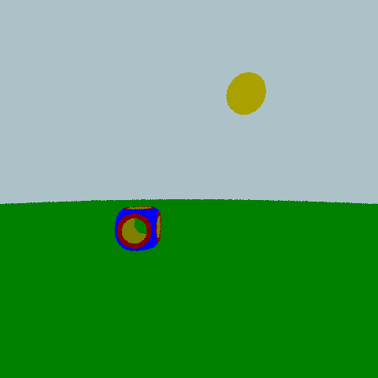
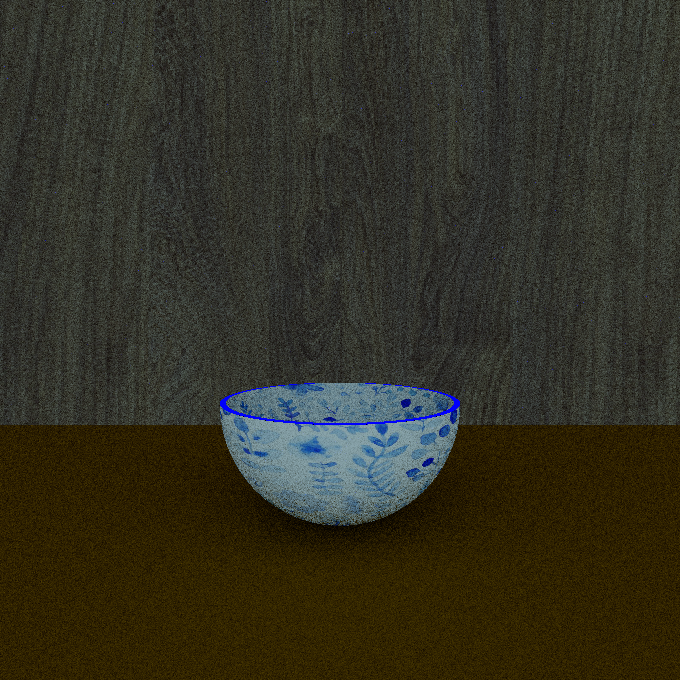

# KTracer

This program is a rayTracer, written in [Kotlin](https://github.com/JetBrains/kotlin). It solves the rendering equation to generate a photorealistic image.  
This project is developed for the rayTracing course (a.y. 20-21) held by professor [Maurizio Tomasi](https://github.com/ziotom78) at the University of Milan, Physics Department.

The contributors to the project are [Matteo Martinelli](https://github.com/MatteoMartinelli97) and [Anna Pivetta](https://github.com/AnnaPivetta). 

## Table of Contents
* [Requirements](#requirements)
* [Distribution](#distribution)
* [Basic Usage](#usage)

### Requirements
KTracers uses [Kotlin](https://github.com/JetBrains/kotlin) version 1.4.31. It is built with [Gradle](https://github.com/gradle/gradle).  
The only external library needed is [clikt](https://github.com/ajalt/clikt/), whose dependency can be added with:
   
    dependencies {
    implementation("com.github.ajalt.clikt:clikt:3.2.0")
    }

More information can be found at [clikt](https://github.com/ajalt/clikt/) repository.
### Distribution
In order to use and modify the code you can clone the repository with the command:
    
    git clone git@github.com:AnnaPivetta/KTracer.git

To check that everything work as expected run the command:

    ./gradlew test

The latest version is available at: 
https://github.com/AnnaPivetta/KTracer/tags  
Each version includes the source code and the built executable.

Distributions can be built from source code running the command:

    ./gradlew assembleDist

### Usage
### Demo mode :white_check_mark:

To do a quick check that everything works you can type the command:

    ./KTracer demo
and this will generate the image [demo.png](https://github.com/AnnaPivetta/KTracer/blob/master/images/demo.png) (if you like this image and want to modify it, you can use the render mode with input file [demo.txt](https://github.com/AnnaPivetta/KTracer/blob/master/examples/demo_input.txt))

### Render mode :art: 
Render mode is the most important one: you can use it to create your own images!
In this mode, the program is able to accept an input file containing a description of the scene to render.
Input file syntax has to follow some very simple rules. You can learn how to write a suitable input file 
looking at these [basic instructions](https://github.com/AnnaPivetta/KTracer/blob/master/examples/BasicInstruction.md) and these tutorials:
* [Tutorial 1](https://github.com/AnnaPivetta/KTracer/blob/master/examples/ex1/tutorial1.txt) (result: [image 1](https://github.com/AnnaPivetta/KTracer/blob/master/examples/ex1/image1.png))
* [Tutorial 2](https://github.com/AnnaPivetta/KTracer/blob/master/examples/ex2/tutorial2.txt) (result: [image 1](https://github.com/AnnaPivetta/KTracer/blob/master/examples/ex2/image2.png))
* [Tutorial 3](https://github.com/AnnaPivetta/KTracer/blob/master/examples/ex2/tutorial3.txt) (result: [image 1](https://github.com/AnnaPivetta/KTracer/blob/master/examples/ex3/image3.png))

Once your input file is ready in order to create your image you can use the command:

    ./KTracer render --inputfile <FILE IN>
The name of the input file is the only required option, but you can also specify some other useful parameters, as:

- `--width | -h <WIDTH>` the width of the image (default is 480)
- `--height | -h <WIDTH>` the height of the image (default is 480)
- `--algorithm | -a <ALGORITHM>` the algorithm used to render the image. Choices are `onoff` (for on-off renderer), `flat` (for flat renderer) and `pt` (for path-tracing renderer). Default is `pt` 
- `--ldr-o | --ldroutput <FILE OUT>` the name of the LDR File containing the image. Default is "renderedimage.png".
- `--nr | -n <NUMBER OF RAYS>` number of rays generated at each surface-ray interaction. Default is 10.
- `--maxDepth | -Md <NUMBER OF REFLECTIONS>` maximum number of reflections per ray. Default is 3.
- `--rrTrigger | -rr <TRIGGER>` depth value after which Russian Roulette algorithm is activated. Default is 2.
- `--AAgrid | --AA | --aa | -A <NUMBER>` number of divisions in each pixel's side to perform antialiasing. If not specified, antialiasing won't be performed.

If you want to know all the options you can specify, type:

    ./KTracer render --help
You can also declare floating-point variable from the command line. For example typing

    ./KTrscer render --inputfile <FILE IN> --declare-float var1=3 --declare-float var2=4.4
you will declare a variable named *var1* whose value is 3, and a variable named *var2* whose value is 4.4.
If your input file already contains floating point variables named *var1* and *var2*, they will take the value passed by command line (command line wins over input file).

The available shapes are plane, sphere, box, cylinder and CSG(constructive solid geometry: you can use it to combine the basic shapes)

### Conversion mode :arrows_counterclockwise:
You can convert an existing .pfm file to a LDR file (format list available [here](https://github.com/AnnaPivetta/KTracer/blob/master/Format_List.txt)) running the command: 

    ./KTracer pfm2ldr --input <FILE IN> --output <FILE OUT> --format <FORMAT>
   
Running:
   
    ./KTracer pfm2ldr --help
   
you can find a list of all the available options

### Animation :movie_camera:

Rotating the camera around the scene you can create an animation.
We provide you a script to create an animation [here](https://github.com/AnnaPivetta/KTracer/blob/master/build/distributions/KTracer-0.2.0/bin/Animation.zsh).
As input file, you can use something like [this](https://github.com/AnnaPivetta/KTracer/blob/master/examples/animation_input.txt), where the camera is rotated by an angle whose value is saved in a variable called *angle*.
If you have an input file you want to use, remember to replace "animation_input.txt" with your file name in the script.
In order to use this script, you have to install [ffmpeg](https://github.com/FFmpeg/FFmpeg).

### Galley

