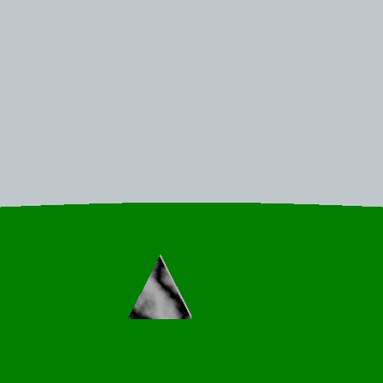

Shapes are the elements that interact with light, building the scene. Everything, from sky
to ground to other objects are shapes, that have been eventually transformed and combined 
to give rise to images.
There are some basic shapes available, and more complex can be obtained by [CSG][1] constructions.

[1]:#csg

## Basic
### Sphere
Sphere is by default the canonical one, with radius=1 and the center in the origin of the axes.
Any deformation must be set with a `scaling` transformation.  
The only two parameters are the `material` and the `transformation`.
    
    ...
    sphere ( sky, scaling([20.0, 20.0, 20.0]) )
    ...

### Plane
The plane by default is the _xy_ plane with _z=0_. Just like the sphere it accepts a `material` and a `transformation` parameter.
    
    ...
    plane ( ground, scaling([20.0, 20.0, 20.0]) )
    ...

### Cylinder
Default cylinders are the one with unit radius and unit height, from _z=-0.5_ to _z=0.5_. As for the previous shapes
they accept a `material` and a `transformation`.

    ...
    cylinder ( woodMat, translation([2.0, 0.0, 1.0]) )
    ...

### Box
Boxes are a little more complicated. Their dimension are given by the point of minimal 
value of vertices' coordinates and the maximum one (which are the 2 opposite vertices along one specific diagonal), even though a `scaling` transformation is always
possible. Then the usual `material` and `transformation` parameter are accepted.

    box (           
        (-0.5, -0.5, -0.5), #Min point
        (0.5, 0.5, 0.5),    #Max point
        minecraft,
        identity
    )

## CSG
Of course the infinite complexity of shapes cannot be captured by only basic shapes. [Constructive Solid Geometry][2] (CSG), does 
not provide a definitive answer to this problem, but offers a powerful tool for 
combining different basic shapes together, that can be exploited to reach exceptional results.  
The combination of shapes is based on three logical operations:

- [difference](#difference)
- [union](#union)
- [intersection](#intersection)

Remember that shape definitions can be of great help when trying to build a complex
CSG object, we recommend to give a look to its documentation in the [input file][3] section.

[2]: https://en.wikipedia.org/wiki/Constructive_solid_geometry
[3]: ../input-file.md#definitions

### Difference
Difference is the operation that, given 2 shapes, builds the object where all the point belonging
to the first shape and not to the second are considered.  
In the following example from a box, two other boxes are removed, each with a different rotation, giving 
birth to a triangular shape.

    shape baseBox box (
        (-0.05, 0.0 , 0.0),
        (0.05, 1.0 , 1.0),
        marble,
        identity
    )

    shape cutBox box (
        (-1.0, -3.0 , 0.0),
        (1.0, 3.0 , 1.0),
        marble,
        identity
    )

    shape baseCrossUnit difference(
        baseBox(identity),
        cutBox(rotation_x(63),
        identity
    )

    shape crossUnit difference (
        baseCrossUnit(identity),
        cutBox( translation([0, 1.0, 0]) * rotation_x(-63) ),
        translation([0, -0.5, -0.5)
    )

    crossUnit(identity)

<figure>
  
  <figcaption> With the difference it is possible to obtain a triangular shape, which will be 
    useful for the top of the final figure </figcaption>
</figure>

### Union
### Intersection
